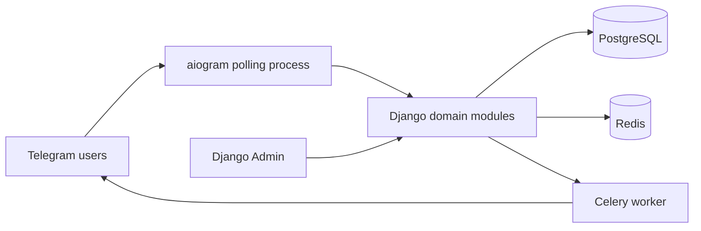

# TableOS — Architecture as implemented

**Status:** audited current state, 2026-07-27.  This document describes
implemented behavior, not the intended future design.  When it differs from
the legacy specification, the discrepancy is recorded in
[`../audits/ARCHITECTURE_AUDIT.md`](../audits/ARCHITECTURE_AUDIT.md).

## System boundary and processes

TableOS is a Django 5 modular monolith with one PostgreSQL database in the
normal deployment, Redis, an aiogram Telegram bot process, and Celery worker
processes.  Local verification can use SQLite with `DJANGO_USE_SQLITE=true`,
but its locking behavior is not representative of production PostgreSQL.

| Process | Entry point / registration | Responsibility | Notes |
|---|---|---|---|
| Django web/admin | `config.asgi`, `config.wsgi`, `config.urls` | HTTP health endpoint and Django Admin | `ScopedAdminMixin` scopes normal partner-owned querysets. |
| Telegram bot | `bot/main.py` → `bot/dispatcher.py` | Polling and handler router assembly | Bot token selects a `Partner`; partner runtime configuration is cached at startup. |
| Celery worker | `config/celery.py` | Notification delivery, scheduled broadcasts, analytics refresh | Autodiscovery registers tasks in `apps.notifications.tasks` and `apps.analytics.tasks`. |
| PostgreSQL | `docker-compose.yml` | durable domain data and transactions | Production default; SQLite exists only as an explicit local mode. |
| Redis | `config/settings/base.py` | Celery broker/result backend | There is no independently deployed bot or beat service in the supplied compose file. |

## Application modules and ownership

The installed Django apps are `partners`, `users`, `tables`, `menu`, `orders`,
`billing`, `bonuses`, `employees`, `notifications`, and `analytics`; `bot` is
the integration/UI app.  `core` supplies shared primitives and `config` supplies
runtime configuration.  `apps/background` is not an installed or implemented
background subsystem.

| Area | Persistent concepts | Primary orchestration | External boundary |
|---|---|---|---|
| Partners | partner, bot settings, content configuration | `apps/partners/services.py`, selectors | Telegram token resolves the partner. |
| Users / identity | global Telegram identity, guest profiles | `apps/users/services.py` | Telegram user data is captured by bot flows. |
| Tables | table, QR token, table session | `apps/tables/services.py` | QR scan starts/resumes a guest session. |
| Menu | categories, menu items | selectors/repositories | Guest menu keyboard and staff configuration. |
| Orders | cart, order, order items, status history | `apps/orders/services.py` | Guest confirm and staff status callbacks. |
| Billing | requests, bills, allocations, payments | `apps/billing/services.py` | Staff billing flows and admin. |
| Bonuses | programs, transactions, walk-in sale | `apps/bonuses/services.py`, `strategies.py` | QR visit, quick sale, bill redemption. |
| Employees | staff profiles, roles and preferences | `apps/employees/selectors.py` | Staff router authorization and delivery targeting. |
| Notifications | notification rows, broadcast campaigns | `apps/notifications/services.py`, tasks | Celery → Telegram. |
| Analytics | daily metrics / report snapshots | `apps/analytics/services.py`, task | Admin/report views. |

## Runtime and bot routing

`bot/dispatcher.py` includes routers in this order: `start`, `session`,
`menu`, `order`, `profile`, `billing`, `guest_call`, `staff`.  aiogram uses
first matching handlers, so the order is behaviorally significant.  Many
partner-configurable button labels are matched by exact text in
`bot/filters/content.py:10-21`; the model validation in
`apps/partners/models.py:251-286` does not establish a cross-field uniqueness
rule for those labels.  Equal/stale labels can therefore route to the first
matching handler rather than to a deterministic product action.

The partner runtime (`bot/services/runtime.py:21-79`) is loaded when polling
starts.  It rejects a suspended partner at startup, but per-update context
(`bot/services/context.py:5-7`) fetches a partner without a status guard.
Suspending an already-running partner consequently does not prove that new
updates will stop being processed.

Guest flows generally derive `partner` from the bot token and use partner-scoped
lookups.  Staff routes use an employee profile resolved for the partner.  The
staff selector filters `EmployeeProfile.is_active` but not `User.is_active`
(`apps/employees/selectors.py:11-16`); this is a confirmed revocation gap.

## Key domain flows

### Guest session, menu, cart and order

1. A QR token resolves a table and `activate_table_session()` creates or
   resumes a `TableSession`.
2. The guest navigates menu content and maintains an active cart.
3. `create_order_from_session()` / `create_order()` creates the order and
   order items.
4. Guest confirmation reloads the order under a row lock
   (`apps/orders/services.py:235-287`).  Staff state transitions use
   `transition_order_status()` but currently trust a passed instance instead
   of reloading it under lock (`:185-232`).
5. Notifications are scheduled through `transaction.on_commit()` for normal
   order events.

The active-session rule is not a durable invariant: `TableSession` has no
partial unique constraint for active `(partner, guest)` rows
(`apps/tables/models.py:43-66`), while activation locks only the selected
table (`apps/tables/services.py:43-91`).  Concurrent scans of distinct tables
can therefore create two active sessions.

### Billing and settlement

1. Staff creates or processes a billing request, creates/updates a bill, and
   attaches orders and order items.
2. A payment is recorded against the bill.
3. Payment completion synchronizes order state and may close the table session.

The service methods carry most intended lifecycle logic, but not all mutation
surfaces use them.  `BillingRequestAdmin` actions perform direct
`queryset.update()` (`apps/billing/admin.py:72-88`), while service validation
rejects transitions such as processed → cancelled
(`apps/billing/services.py:786-803`).  Bill and order fields/inlines remain
editable in admin.  Additionally, allocation checks in
`create_bill_from_orders()` and `attach_orders_to_bill()` are check-then-create
without locks on the canonical order/item rows
(`apps/billing/services.py:134-182,252-309`) and `BillItem` has no durable
uniqueness rule for one allocated order item.

### Loyalty and quick sale

Visit bonuses are invoked after table-session activation
(`apps/tables/services.py:83-90`); manual-purchase bonuses are invoked for a
walk-in sale.  The default `ORDER_COMPLETED` trigger is present in models and
seed data, but no production caller dispatches it from an order lifecycle.
`apply_bonus_programs()` and bill redemption mutate the guest wallet without a
canonical guest-row lock, so concurrent redemption/accrual remains unsafe.

### Notifications and broadcasts

Order-related notification enqueueing normally uses `on_commit`.  Broadcast
delivery is materially different: `send_broadcast_campaign_now()` is
transactional while it calls Telegram and can sleep for retries
(`apps/notifications/services.py:440-547`).  Its Celery task fetches a
campaign without a lease, cursor, recipient delivery ledger, or idempotency
guard (`apps/notifications/tasks.py:59-72`).  Multiple workers or retries may
duplicate delivery and counters.

## Data ownership, tenancy, and authorization

Most domain models inherit `PartnerBoundModel`, which only supplies a Partner
foreign key (`core/database/models.py:22-33`).  Ordinary Django foreign keys
cannot ensure that all linked records have the same partner, and no service or
database invariant universally fills that gap.  Normal bot paths are generally
scoped; however direct service APIs (for example `create_order`) accept objects
without universally validating a common partner.  The Django Admin presents a
second write boundary where mutable lifecycle/financial fields and inlines can
bypass the services.

`ScopedAdminMixin` scopes change lists and direct related field choices.  It
does not scope the `partner` list filter: an audited tenant-owner probe showed
four global partner choices with a one-partner data scope.  Inline classes are
not themselves `ScopedAdminMixin` subclasses; current default seed permissions
hide several child inlines, but granting child permissions would expose an
unscoped write surface.

## States and constraints actually enforced

| Concept | Intended transition mechanism in code | Durable protection today |
|---|---|---|
| Order | `transition_order_status()` service and staff/admin actions | State choice and history model; no locked reload for generic transition. |
| Billing request | billing service | Admin bulk actions bypass service state guard. |
| Bill/payment | billing services | Bill row is locked for payment; allocations/wallet have gaps. |
| Table session | table service | No unique active session per guest; admin can edit status directly. |
| Bonus wallet | bonus/billing services | Ledger has no source FK/idempotency key; no guest-row serialization. |
| Broadcast | notification service/task | No worker lease, recipient ledger, or idempotent send boundary. |

## Import and dependency map

The repository has 221 first-party Python files (20,516 LOC) and 25 numbered
migrations.  Direct static app dependencies are intentionally not acyclic:
`analytics` depends on billing/bonuses/orders/partners/tables/users;
`billing` on bonuses/notifications/orders/partners/tables; `orders` on
employees/menu/notifications/tables/users; and `tables` on billing/bonuses/
orders/users.  `bot` imports all domain applications.  The only direct module
SCC found by AST analysis is `apps.notifications.services ↔
apps.notifications.tasks` through a function-local task import.

`services.py`, `selectors.py`, and `repositories.py` are naming conventions,
not an enforced architecture.  Several `interfaces.py` modules contain
protocols with no application consumers; `apps/employees/services.py` and
`apps/menu/services.py` contain only docstrings; most app `tasks.py` modules
are placeholders.  There are no production `policies.py`, `rules.py`, or
`engine.py` modules.  These are recorded as consolidation candidates rather
than deleted during this audit.

## Observability and tests

The project has structured logging helpers and 17 test modules.  The baseline
ran 139 tests successfully in SQLite mode, which does not characterize
PostgreSQL locking.  There are no audited tests for the concurrent session,
order transition, bill allocation, wallet, broadcast, inactive-staff,
suspended-runtime, stale-callback, or admin cross-tenant/lifecycle cases.
See [`../audits/BASELINE.md`](../audits/BASELINE.md) and
[`../audits/FILE_COVERAGE.md`](../audits/FILE_COVERAGE.md) for reproducible
coverage and command results.
