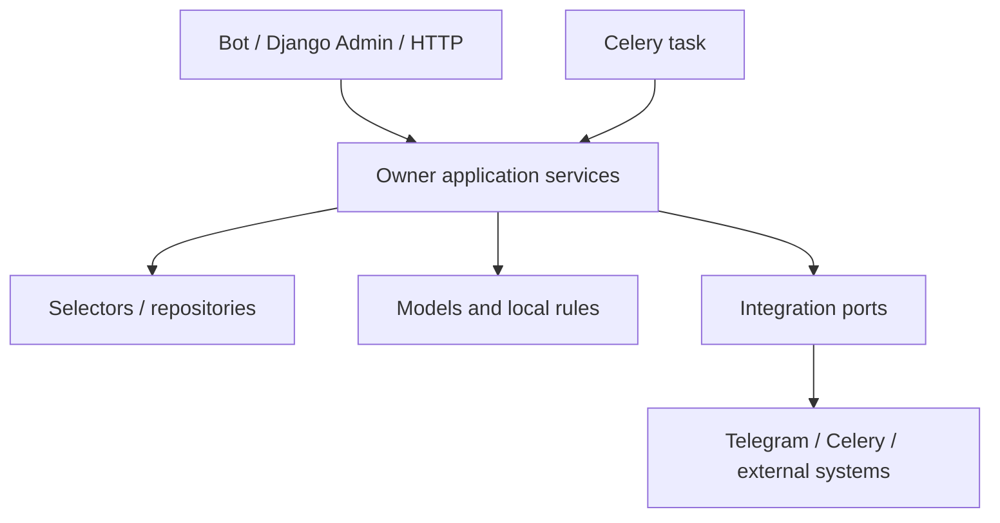

# TableOS — Module boundaries

**Status:** governance target for a modular monolith.  It does not authorize
moving code during the audit phase.

## Boundary rule

Each business module owns its models, migrations, application services,
selectors, and module-specific integration adapters.  A caller should express
an intent through the owner module rather than write another module's model or
reimplement its lifecycle.  Import compatibility stays in place until a
separate approved migration has characterization tests and a deprecation plan.

| Module | Owns | May coordinate with | Must not own |
|---|---|---|---|
| `partners` | tenant lifecycle, bot settings, content configuration | users, employees, bot runtime | guest/order/bill lifecycle |
| `users` | global Telegram identity and guest profile | tables, orders, bonuses | partner authorization policy |
| `tables` | table inventory, QR token, session lifecycle | users, orders, bonuses | order status and payment settlement |
| `menu` | category and item catalogue | orders, bot presentation | cart/order mutation |
| `orders` | cart, order, order-item and order-state lifecycle | tables, menu, employees, notifications, billing | payment ledger and bonus wallet mutation |
| `billing` | billing request, bill, allocation, payment, settlement orchestration | orders, tables, bonuses, notifications | menu catalogue or staff permission policy |
| `bonuses` | programs, wallet ledger, reward/redemption rules, walk-in sale | users, billing, tables | bill state transitions |
| `employees` | employee profile, role, preferences, staff eligibility | partners, notifications, orders | global Telegram identity mutation without a dedicated identity policy |
| `notifications` | durable notifications, campaign lifecycle, delivery adapter/task | employees, orders, partners, tables, users | source-domain state changes |
| `analytics` | read models, aggregations, reports | all modules via explicit read contracts | operational writes to foreign aggregates |
| `bot` | Telegram handlers, DTO/keyboard presentation, routing | module services/selectors | business invariants or direct financial writes |
| `core` | genuinely cross-cutting primitives only | all | domain-specific entities and cycles |

## Cross-module contracts

Until an explicit internal event mechanism is approved, a cross-module call is
allowed only when it has a named owner service, a clear transaction boundary,
and a partner/actor context.  This means a service signature should receive
scoped domain objects or a trusted `partner_id`; it must never infer authority
from arbitrary callback payload, global Telegram identity, or an unvalidated
foreign key.

Use explicit contracts for these recurring integrations:

| Producer | Consumer | Contract direction | Current governance concern |
|---|---|---|---|
| Orders | Notifications | accepted domain event after commit | Existing `on_commit` use is a useful baseline. |
| Billing | Orders / Tables / Bonuses | settle bill and source-linked redemption | Needs serialized allocation/wallet rules. |
| Tables | Bonuses | visit credit after a session is valid | Needs active-session invariant and idempotent source. |
| Partners | Bot | runtime capability/configuration snapshot | Needs live suspension/capability semantics. |
| Notifications | Telegram | durable delivery intent → worker | Needs transaction-free I/O and delivery idempotency. |
| Analytics | all domains | read-only reporting projection | Avoid write-back into source aggregates. |

## Target allowed dependency direction

Handlers, admin actions and tasks are adapters; they do not contain alternate
implementations of lifecycle transitions.  Selectors are read-only.  A
repository earns its existence only when it centralizes a meaningful persistence
boundary, not merely wraps a one-line ORM query.  No generic shared domain
service should be introduced merely to eliminate an import.

## Stable seams for the first approved batches

1. **Tenant and actor guard seam.** A small shared helper may resolve a
   trusted partner/actor, but ownership validation remains in the owner service.
2. **Order state seam.** All order state writes pass through a locked owner
   service; bot/admin translate user intent only.
3. **Money seam.** Bill allocation, payment, and wallet changes pass through
   owner services with a documented lock order and immutable ledger/source
   linkage.
4. **Notification seam.** Source modules create a durable post-commit delivery
   intent; a worker performs Telegram I/O outside the originating transaction.
5. **Admin seam.** Django Admin can view scoped data and invoke approved service
   actions.  It cannot freely edit state-machine, ledger, allocation, or total
   fields.

## Anti-corruption rules

- Do not make `bot` a domain service layer; keep aiogram types out of domain
  services.
- Do not allow one module to update a foreign aggregate via `QuerySet.update()`.
- Do not pass a bare object ID across a module boundary when a scoped lookup is
  required.
- Do not fold unrelated modules into a new `common`, `utils`, or `services`
  package.
- Do not assume admin scoping makes a lifecycle write safe; authorization and
  invariant enforcement are separate responsibilities.
- Do not create an event bus, outbox, CQRS subsystem, or repository hierarchy
  before the approved roadmap batch establishes the narrower need.
