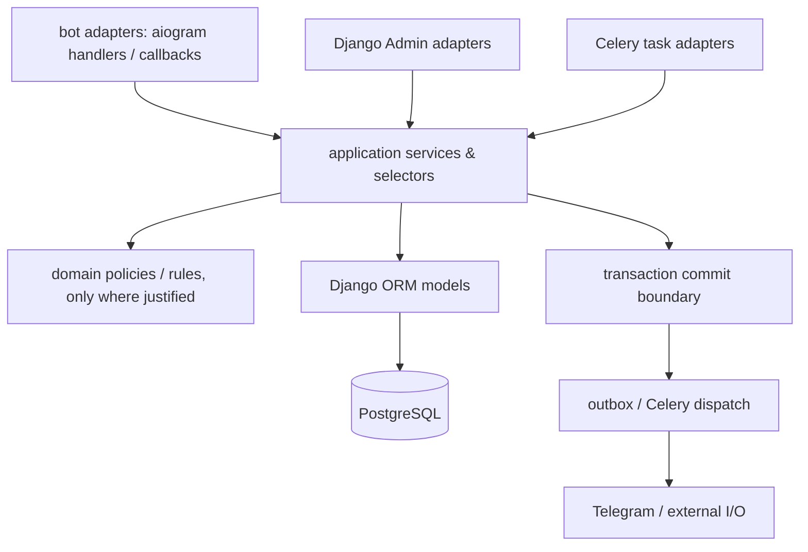

# Целевая архитектура TableOS

**Статус:** target state / архитектурный контракт.  
**Владелец:** команда TableOS.  
**Основание:** результаты аудита `docs/audits/ARCHITECTURE_AUDIT.md` и решения в `docs/decisions/`.

## 1. Цель и границы

TableOS остаётся **модульным монолитом** на Django, aiogram и Celery. Это намеренное решение: один развёртываемый продукт, общая транзакционная база для денежных и операционных процессов, а также небольшой набор тесно связанных предметных областей не оправдывают сервисную декомпозицию.

Цель — сделать существующие предметные правила явными и проверяемыми без «чистой архитектуры ради папок». В частности, архитектура должна предотвращать подтверждённые в аудите риски: кросс-партнёрские связи, обход lifecycle через Django Admin, повторные денежные операции и отправки, устаревшие права staff-пользователя и I/O внутри транзакции.

Это не план переписывания приложения. Сохраняются Django ORM, Django Admin, aiogram routers, Celery и существующие публичные пути импорта до их отдельно согласованной миграции.

## 2. Карта модулей

Каждый бизнес-объект принадлежит одному `Partner`, если он не является явно глобальной идентичностью. Владение и допустимые зависимости определяются ниже.

| Модуль | Ответственность | Может зависеть от |
| --- | --- | --- |
| `partners` | tenant root, настройки бота, feature/capability configuration | `core`, `users` |
| `users` | глобальная Telegram-идентичность и partner-scoped guest profile | `core`, `partners` |
| `employees` | staff profile, роль, доступ и смены | `core`, `partners`, `users` |
| `tables` | QR, table session, гостевой контекст | `core`, `partners`, `users` |
| `menu` | категории и позиции меню | `core`, `partners` |
| `orders` | корзина, заказ, позиции, статус заказа | `core`, `employees`, `menu`, `partners`, `tables`, `users` |
| `billing` | счета, запросы, оплаты, распределение позиций | `core`, `orders`, `partners`, `tables`, `users` |
| `bonuses` | программы, ledger и применение бонусов | `core`, `orders`, `partners`, `users` |
| `notifications` | уведомления staff/guest и кампании | `core`, `employees`, `orders`, `partners`, `tables`, `users` |
| `analytics` | read-model и отчётные снимки | все доменные модули только на чтение |
| `bot` | Telegram adapter, runtime, маршрутизация и presentation | application API всех нужных модулей |
| `core` | общие технические примитивы, scoped admin, базы и logging | не зависит от доменных приложений |

`analytics` не становится владельцем доменной записи и не вызывает команды, меняющие чужое состояние. `bot` не содержит доменные инварианты: его обработчики переводят Telegram update в типизированную команду/запрос и показывают результат.

## 3. Нормативные слои

Слои описывают назначение, а не обязательную глубину каталогов. Новый слой вводится только когда у него есть отдельная ответственность и потребитель.

| Слой | Разрешённая ответственность | Не должен делать |
| --- | --- | --- |
| Adapter | `bot` handlers/keyboards/filters, admin, management commands, Celery task entrypoints | реализовывать денежные/state правила или делать unscoped ORM-запросы |
| Application service | команды, транзакционные use case, authorisation, orchestration, domain events | рендерить Telegram/UI или прятать долгоживущий workflow в task |
| Selector | read-only scoped query и DTO/read model | изменять модели или заменять доменную команду |
| Domain policy/rule | детерминированное правило, применимое из нескольких use case | выполнять I/O, ORM-запросы без явного gateway или быть пустой «абстракцией» |
| Repository | нужен лишь для сложного persistence/query boundary с несколькими потребителями | дублировать простой selector или быть фасадом к одному `objects.filter` |
| Model | локальные данные, DB constraints, простые модельные проверки | координировать кросс-модульный бизнес-процесс |
| Task | короткий retryable adapter с идемпотентным входом | держать сетевой вызов внутри доменной транзакции или принимать решение о правах |

### 3.1. Правило направленности

* `core` не импортирует `apps.*` или `bot`.
* Один доменный модуль не обращается к модели другого модуля из adapter-а; он вызывает опубликованный application API владельца либо использует явно разрешённый read selector.
* Циклические импорты между `services`, `tasks` и handler-ами не допускаются. Task получает стабильный идентификатор команды, а не импортируется внутри domain service для обратного вызова.
* `interfaces.py`, `repositories.py`, `policies.py`, `rules.py` и `engine.py` создаются только с документированным потребителем. Нулевой или единственный косметический интерфейс не является слоем.

### 3.2. Публичные API модулей

Стабильной поверхностью являются именованные commands/selectors и documentированные import paths. Внутреннее перемещение реализуется так:

1. новый API и characterization tests появляются до переноса;
2. старый import path оставляет тонкий re-export с предупреждением о deprecation;
3. все first-party consumers мигрируют;
4. удаление допускается только после поиска статических, Django/Celery/aiogram динамических потребителей и согласованного периода совместимости.

## 4. Tenant isolation и доступ

### 4.1. Инвариант владения

Для любой partner-bound команды выполняется одновременно:

1. actor, target и все переданные связанные объекты принадлежат одному `Partner`;
2. partner выводится из авторизованного контекста, а не доверяется callback payload или form field;
3. selector фильтрует по `partner_id` в самой точке запроса;
4. создание и обновление валидируют межмодельные связи;
5. важные инварианты дублируются на уровне PostgreSQL после отдельной миграции данных.

Обычный `CheckConstraint` не может надёжно сравнить поля двух таблиц. Для кросс-табличной принадлежности выбирается один явно задокументированный механизм после data audit: составные внешние ключи/уникальные ключи, trigger constraint или денормализованный `partner_id` с проверяемой согласованностью. Решение должно быть миграционно обратимым и сопровождаться проверками существующих данных. До DB enforcement application-service validation обязательна, а не временно факультативна.

### 4.2. Авторизация

* Telegram user — глобальная identity; guest/staff profile — partner-scoped role. Изменение Telegram ID и прямой global `TelegramAccount` Admin доступны только superuser. Владелец заведения (и сотрудник с выданным разделом `Employees`) может менять `@username` и поля профиля своего сотрудника; владелец также меняет username/имя venue-пользователя через scoped `UserAdmin`. Поскольку `@username` хранится в global identity, это owner-approved изменение отображается во всех её контекстах. Данные, полученные из Telegram update-а, остаются доверенной синхронизацией от платформы Telegram.
* Staff access требует одновременно активного `User`, активного `EmployeeProfile`, корректной partner связи и нужной capability. Все callback handlers повторно проверяют capability на момент действия, не только при построении клавиатуры.
* `Partner.status=suspended` проверяется в per-update/session resolution, а не только при старте bot runtime. Suspended partner получает стандартный paused-work response; `BotInstance.is_active=False` не обрабатывает update, а polling transport останавливается при restart runtime process.
* Django Admin получает тот же scoped command/query API. List filters, foreign keys и inline forms не должны раскрывать другие tenant-ы; отсутствие object permission не считается достаточной изоляцией.

### 4.3. Роли и конфигурация

`UserRole`/`EmployeeProfile` — источник доменных полномочий. `AdminAccessProfile` ограничивает доступ к back office, но не заменяет проверку активного staff-профиля и section capability. Правило «кто может выполнять команду» живёт в application service/policy, а не в одном конкретном Telegram handler-е.

## 5. Деньги, lifecycle и Admin

Денежные процессы (заказ, счёт, позиция счёта, оплата, бонусный ledger) имеют единственную командную точку входа. Состояние не меняется через прямое редактирование полей в Admin, queryset `.update()` или nullable relationship.

| Область | Целевой инвариант |
| --- | --- |
| Заказ | статус меняется через таблицу разрешённых переходов и locked current row; history и уведомление создаются ровно один раз |
| Счёт/оплата | изменение счёта и запись оплаты сериализуются на bill/guest scope; сумма, статус и закрытие session вычисляются в одной команде |
| Распределение позиции | одна активная allocation на `OrderItem`; конкурентные команды не могут прикрепить позицию к двум счетам |
| Бонусы | ledger append-only; balance меняется только командой, которая блокирует guest scope и имеет idempotency key/correlation id |
| Admin | финальные записи/ledger read-only; разрешённые операции — явные admin actions, вызывающие тот же service и подтверждающие actor/reason |

Для каждой command определяется: actor, partner scope, idempotency semantics, lock set, разрешённый исходный статус, побочные эффекты после commit и observable audit trail. Прежде чем включать DB constraint, миграция проверяет и исправляет/карантинирует legacy data по согласованному плану.

## 6. Транзакции, конкуренция и асинхронность

### 6.1. Командная транзакция

Команда открывает короткую `transaction.atomic()` только для чтения/проверки/изменения локальных строк. Она получает актуальные строки через `select_for_update()` в стабильном порядке и не использует объект, загруженный до блокировки, как источник истины. Конкурентно изменяемые use case покрываются тестами на PostgreSQL: повторный callback, параллельный scan, attach bill item, payment/bonus redemption.

B2 фиксирует lifecycle lock order для уже поддержанных команд: активация
сессии — `GuestProfile → Table → active TableSession`; order transition
блокирует canonical `Order`; payment completion — `Bill → Order →
BillingRequest → TableSession`. Partial unique constraint на активную сессию
применяется только после duplicate-data audit. SQLite-тесты не заменяют
PostgreSQL concurrency evidence.

### 6.2. Внешние эффекты

Telegram и другой network I/O запускаются **после successful commit**. `transaction.on_commit()` публикует durable command/job, а task доставляет её с идемпотентным ключом. Запрещены `sleep`, retry loop и сетевой запрос внутри открытой транзакции.

Для broadcast и иных fan-out процессов используется запись состояния доставки: campaign/job lease, stable recipient identity, message/delivery key, attempt count, outcome и cursor/partition. Повтор task-а и два worker-а не дают повторную отправку или двойной счётчик. Уведомления перед отправкой заново проверяют актуальный доступ/предпочтения получателя, когда это требуется продуктом.

### 6.3. Celery и scheduler

Зарегистрированные tasks документируются вместе с trigger-ом, идемпотентностью, retry policy и владельцем. Periodic jobs должны быть запущены фактическим scheduler-процессом; compose/deployment documentation явно различает web, worker, bot и beat. Невыполняемая задача не считается поддержанной функцией.

## 7. Bot runtime

Runtime загружает только неизменяемую конфигурацию, нужную для подключения. Контекст update-а всегда повторно разрешает partner, статус, actor и capability. Callback data несёт идентификатор и короткий intent, но никогда не является доказательством tenant-а, employee или права.

Маршруты с partner-configured текстом/кнопками не используют неоднозначное точное совпадение без namespace/route key. Изменение контента валидирует уникальность route key и совместимость с зарегистрированным handler-ом. Для нескольких потенциальных совпадений router обязан иметь детерминированный, тестируемый результат либо отклонить конфигурацию.

## 8. Миграционная стратегия

Работа выполняется малыми batch-ами из `docs/audits/REFACTOR_ROADMAP.md`:

1. characterization tests и observability;
2. высокорисковые service guards и Admin restriction;
3. backfill/data audit, затем DB constraints и concurrency protection;
4. выравнивание runtime/tasks;
5. только после этого — упрощение пустых абстракций и document cleanup.

Каждый batch имеет rollback, invariant checks, PostgreSQL verification и список public import paths. Нельзя объединять структурный перенос с изменением бизнес-семантики без отдельного ADR/решения владельца.

## 9. Definition of done для архитектурного изменения

Изменение считается готовым, только если:

* указан owning module и слой;
* все входы scoping/authorization проверены;
* transaction boundary, lock set, idempotency и side effects задокументированы для command;
* Django Admin и bot не имеют альтернативного небезопасного пути;
* есть regression/characterization test в нужной среде, включая PostgreSQL для конкуренции и DB constraints;
* динамические consumers (admin, router, Celery autodiscovery, management command) проверены;
* обновлены canonical docs и, при изменении правила, ADR.

## 10. Явно не является целью

* не выделять микросервисы или отдельные базы данных без измеримой операционной необходимости;
* не добавлять repository/interface/policy только ради единообразного имени файла;
* не заменять Django ORM самописной persistence abstraction;
* не считать документацию или локальный SQLite достаточным доказательством корректности tenant/money/concurrency сценария.
